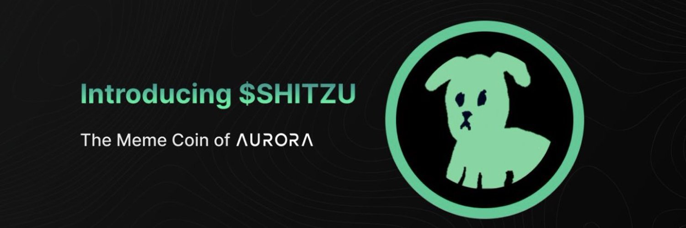

# Introducing Shitzu

In the quirky world of cryptocurrencies, the birth of Shitzu memecoin stands out as a testament to the power of community and the whimsy of digital innovation. This unique token sprung into existence from an April Fool's event that captured the imagination and fingers of crypto enthusiasts worldwide.

## A Button, A Challenge, A Legacy

For 24 thrilling hours, a mint button was cleverly concealed, setting the stage for a minting marathon like no other. The challenge? Find the button and mint Shitzu tokens. The result? An astounding 576,167,000 tokens were brought to life, each one a proof of finger – a testament to the dedication and quick clicks of participants. This remarkable feat meant that the mint function was activated 576,167 times in just a day, a figure that resonates with the vibrant pulse of the crypto community.

## From Fingers to Fame

The extraordinary birth of Shitzu did not go unnoticed. Among its admirers was none other than [@AlexAuroraDev](https://twitter.com/AlexAuroraDev), the esteemed CEO of Aurora, whose [tweet](https://twitter.com/alexauroradev/status/1516890499851952128) about the event sent waves of excitement across the digital sphere. The tweet, a nod to the unique inception of Shitzu, can be seen here, encapsulating the buzz and intrigue that surrounded this memecoin's arrival.
