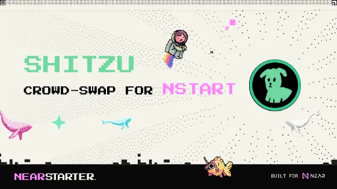

# SHITZU is joining NEARIA

The SHITZU Community, a key ally of NEARStarter since August 2022, actively participates in enriching the NEAR/Aurora ecosystem through collaborative events and the NEARIA Index Pool. To represent SHITZU in the NEARIA Index, a unique crowd-swap is initiated, inviting SHITZU holders to contribute tokens, enhancing the index's diversity and mirroring the vastness of the ecosystem. This innovative swap, a testament to the community's decentralized spirit, allows SHITZU to be part of the NEARIA Index, marking another pioneering venture in the industry by NEARStarter and the SHITZU Community.

[Read the full story here](https://medium.com/near-starter/shitzu-will-join-nearia-via-crowdsource-swap-5f2068cb07e1)
