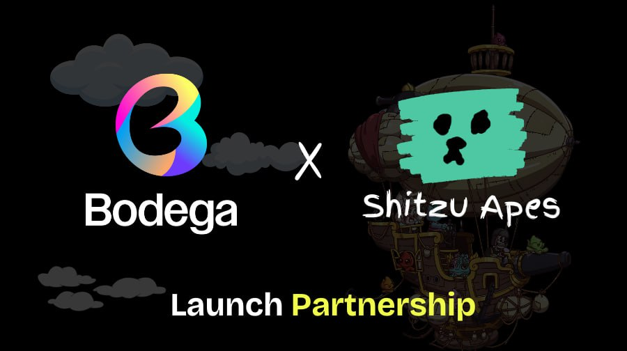
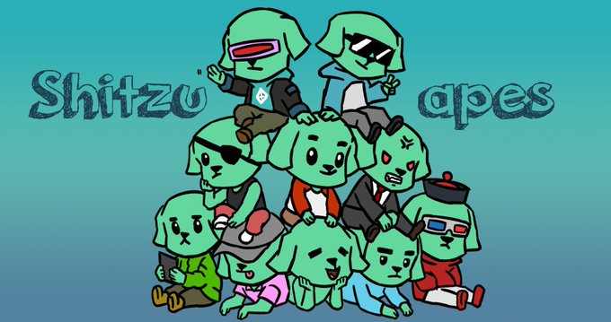

# SHITZU's 2nd Anniversary NFT Collection: A Token of Our Journey Together

As we approach the 2nd anniversary of SHITZU, a token that revolutionized the meme ecosystem with its unique Proof of Finger consensus and community-driven ethos, we're excited to announce the launch of an exclusive NFT collection. This collection is not just a celebration of our journey but also a testament to our unparalleled community's strength and creativity.

## The Celebration NFT: Details & How to Participate

- **Minting Price**: 4 NEAR
- **No Whitelist**: Proof of Finger Spirit, there's no whitelist to participate. Everyone has a fair chance to be part of this celebration.
- **Proceeds for the Community**: All proceeds from the NFT sales will support the SHITZU DAO, further empowering our community's initiatives and projects.
- **Double Rewards for NFT Holders**: Holders of the SHITZU NFT will receive double rewards when completing [SHITZU Tasks](https://t.me/ShitzuTasks), enhancing the value and fun of participating in our community-driven challenges.
- **Total Supply**: Only 1,000 NFTs will be available, ensuring that these tokens of appreciation remain exclusive and special.
- **Purchase Limit**: To ensure fair distribution, each address can mint up to 10 NFTs.
- **Mint Date**: The minting starts on 1 April 2024, at 15:00 GMT, marking the exact anniversary of SHITZU's launch.
- **Launch Partner**: We're thrilled to collaborate with [@bodega_web3](https://twitter.com/bodega_web3), a leading light in the web3 space, for this launch.
- **Mint Link**: Secure your piece of SHITZU history [here](https://side.xyz/bodega).

## Why Join the Celebration?

This NFT collection is more than just digital art; it's a celebration of SHITZU's journey, a contribution to its future, and a chance to enjoy enhanced rewards and participation in our vibrant community.

## Ready to Be Part of SHITZU's Legacy?

Don't miss this opportunity to own a piece of SHITZU history and to contribute to its bright future. Mark your calendars, join us in celebration, and continue to be an invaluable part of our journey. Here's to many more years of innovation, community, and fun!
