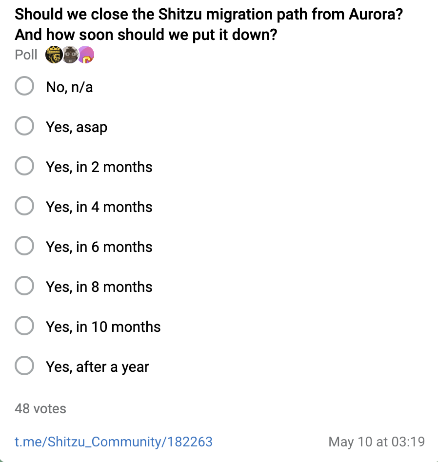

## 𝐒𝐇𝐈𝐓𝐙𝐔 v𝟐

1. Shitzu had a new community takeover! Users have been given the opportunity to bridge their legacy tokens (ERC-20) over to Near (NEP-140). This shelter offerred the Shitzu community the chance to enjoy both incentives and better liquidity compared to Aurora.

2. Community acquisition and price action now happens on Near.
   The community doesn't want to jeopardize its growth and would like to protect NEP-140 $SHITZU holders for sudden and unpredictable liquidity exits by its former and unengaged community members.

3. The majority of the community has expressed their opinion to close the bridge and retire from its Aurora legacy. Therefore, the BOS component that lets you migrate $SHITZU from Aurora to the new contract on Near will be ceased on short notice.

4. This is the final call to migrate any of your remaining legacy tokens through https://near.social/marior.near/widget/ShitzuMigrate. A countdown on the bridge indicates the remaining migration time left

As of the time of writing, 48 community members have voted to close the bridge and the result is as follows:

- 27% keep the bridge open

- 42% close the bridge as soon as possible

- 23% close the bridge within 2 months

- 2% close the bridge within 4 months

- 2% close the bridge within 6 months

- 4% close the bridge after a year

The community has spoken. The bridge will be closed. The final date to migrate your legacy tokens is Mid June 2024.
