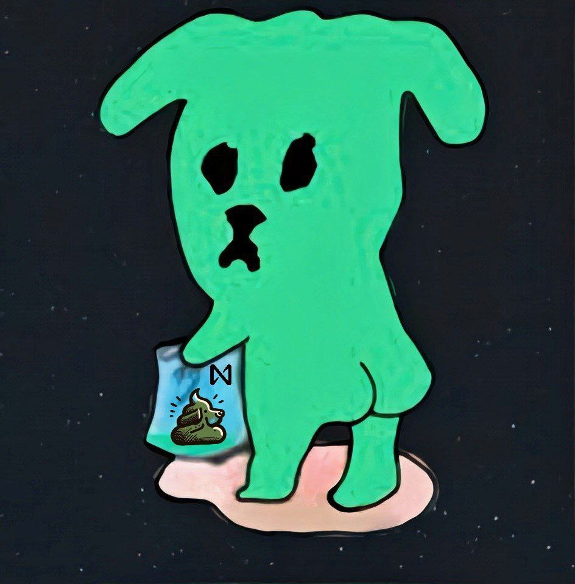

## The shit hits the fan!

We are thrilled to announce the launch of $DOGSHIT! This token will represent a percentage of participation in Shitzu's meme pool. $DOGSHIT is a Fungible Token (FT) used as reward for stakers with the shitzu.pool.near validator. The way it works is that the contract wraps popular memecoins like $SHITZU, $LONK and $BLACKDRAGON. 

Underlying meme tokens can be claimed by burning the 💩! 

You can stake your $NEAR directly through [app.shitzuapes.xyz](https://app.shitzuapes.xyz/stake) which currently supports Meteor- and Here wallet. The app also reflects the proper APY. Alternatively, you can stake from telegram via the [HOT wallet](https://t.me/herewalletbot/app?startapp=web-shitzuapes). Holders of the [Shitzu Revival NFT](https://beta.mitte.gg/?r=c3RlZWtqZW5lYXIudGc=) will receive a 20% increased staking reward!

In order to celebrate the opening of our new shelter you can claim a small treat at https://shard.dog/shitzu.

Did we mention a retrospective shit(zu)drop to random holders of this sharddog?? 👀
