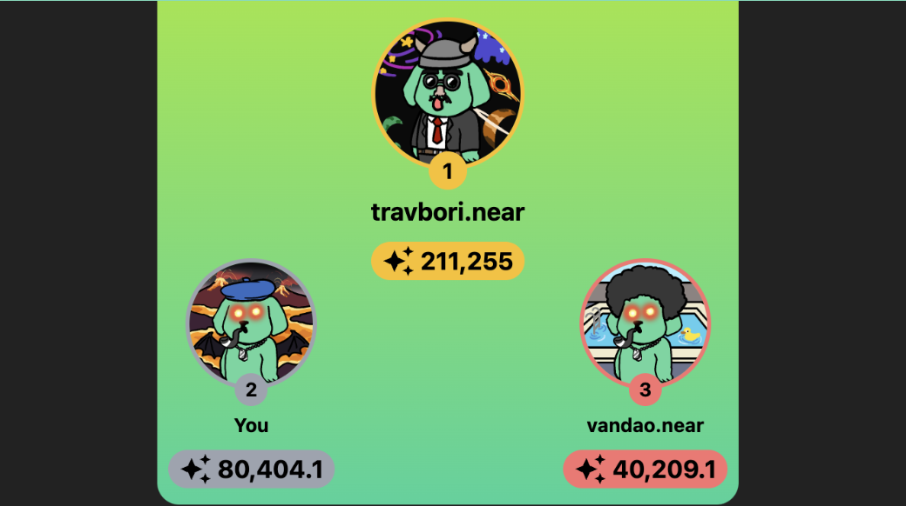

## You can't be me, I'm a SHITSTAR

We are thrilled to announce the launch of the Shitstars system, a revolutionary point and reputation system within the SHITZU ecosystem. This new feature rewards users for their active participation and contributions, enhancing the value and engagement within our community.

### What is Shitstars?

**Shitstars** is a point and reputation system within the SHITZU ecosystem. It rewards users for their participation and contributions. The individual who earns the most Shitstars is also called **the Shitstar**.

### What is the relationship between Shitstars and NFTs?

Shitstars are attached to a single primary NFT, and they remain attached even if the owner of the NFT changes. This ensures that the value and reputation built through earning Shitstars stay with the NFT, adding to its significance and worth.

### How are Shitstars earned?

Shitstars can be earned in three exciting ways:

1. **Donating $SHITZU:**
   Donate SHITZU to rewards.0xshitzu.near and receive Shitstars equal to four times the donation amount. Your generosity not only supports the ecosystem but also boosts your standing as a Shitstar. [Donate here](https://app.shitzuapes.xyz/shitstars#donation)

2. **Participating in Shitzu Boost:**
   Join the Shitzu Boost events and receive Shitstars equal to the Shitzu reward earned (x2 the normal amount). This is a great way to double your rewards and climb the ranks of the Shitstars. [Participate here](https://t.me/ShitzuTasks)

3. **Staking with Shitzu Pool:**
   Stake with the Shitzu pool and receive Shitstars equal to three times the Shitzu earned upon burning $DOGSHIT. This method offers a substantial boost to your Shitstars, reflecting your commitment to the ecosystem. [Stake here](https://app.shitzuapes.xyz/stake)

### How do I get started with earning Shitstars?

To get started, you will need to acquire a SHITZU Revival NFT and stake it [see](/blog/2024-04-04-nft-minting-wrap-up). Then, follow the instructions for one of the three methods of earning Shitstars mentioned above. It's simple, rewarding, and a fantastic way to become an integral part of the SHITZU community.

### Become the Shitstar

Don't miss out on this opportunity to enhance your reputation within the SHITZU ecosystem. Remember, you are not just donating or participating—you are becoming the Shitstar. Start earning your Shitstars today and join the elite ranks of our most valued contributors.

Join us on this exciting journey and prove that **"You Can't Be Me, I'm a Shitstar."**

https://app.shitzuapes.xyz/shitstars
