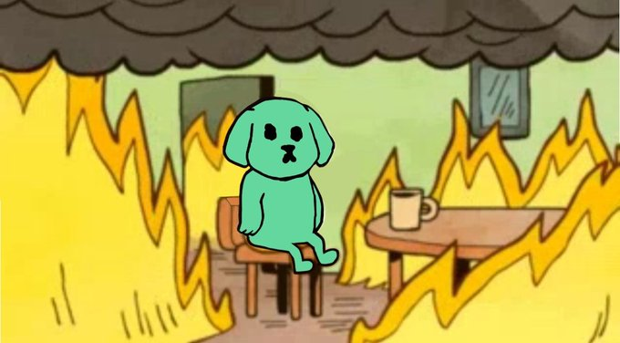

The SHITZU community has recently achieved a historic milestone by burning an astounding 269,924,931 million $SHITZU tokens🔥. This significant event was backed by the majority of our community, who supported the retirement of legacy tokens on its former blockchain. The tokens that have been removed from circulation represented approximately **47% of the total supply**!

This deflationary action has not only stabilized the community’s market position but also paved the way for us to build more valuable solutions. Importantly, supporters of the project are not jeopardized by the supply left behind on Aurora.

In a thrilling turn of events, 29k tokens on Aurora managed to secure a safe passage to $NEAR just minutes before the bridge was burned down. Unfortunately, tokens that didn't make it on time will be left wandering on Aurora. This is the blockchain that gave birth to our new community through Proof of Friendship (PoF).

As of now, the total $SHITZU supply stands at **306,242,069 tokens**, all of which are fully in circulation. Here are some key statistics:
- $SHITZU on $NEAR has **11,560 holders** 
- $SHITZU leaves behind **1,190 dormant ERC20-wallets**

For more details, please refer to the following links:
- [Aurora Token Explorer](https://explorer.aurora.dev/token/0x68e401B61eA53889505cc1366710f733A60C2d41?tab=holders)
- [Nearblocks Token Info](https://nearblocks.io/token/token.0xshitzu.near?tab=Info)

Born on April Fool's Day, $SHITZU keeps it refreshingly simple: **306,242,069 tokens**, period. All tokens are circulating, with no lock-ups or vesting periods.
