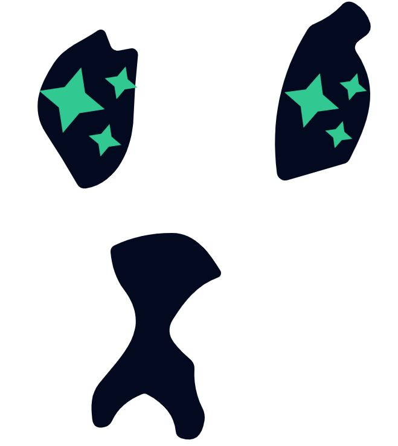

## Shitstars: earn your way to the top (walkthrough)

The Shitzu community incentivizes users to explore and adopt new technologies within the NEAR ecosystem by rewarding participation. The Shitzu Revival NFT is now playing a key role in this learn-to-earn program.

Shitstars are attached to staked Revival NFT's. They act as building blocks for a system that tracks user's on-chain reputation. Active community participation, staking, voting, farming and amplifying NEAR projects all play a role in shaping this digital track record.

https://app.shitzuapes.xyz/shitstars

A high reputation score signifies trust and value from the community. This can unlock several benefits. With a strong reputation, you're more likely to be included in OG NEAR ecosystem groups. Top-10 Shitstars also receive daily $SHITZU rewards, make sure to gm :star2:

Shitstars are non-tradable tokens on NEAR. You can only acquire Shitstars by staking your Shitzu Revival NFT first. Once staked, the game begins.

Through the following options, participants can collect Shitstars and earn their way to the top:

-   Donating $SHITZU
	- For every Shitzu donated, your SHITZU Revival will earn **4 times** the amount of Shitstars.
-   Participating in Shitzu Boost
	- For every Shitzu earned through the boost program your SHITZU Revival will earn **1 time** the amount of Shitstars.
-   Burning $DOGSHIT
	- For every Shitzu received by burning $DOGSHIT, your SHITZU Revival will earn **2 times** the amount of Shitstars.
-   xREF staking
	- Everyone starts with a base of **100 Shitstars**. You can earn up to 100 additional Shitstars, calculated as the minimum between 100 and the square root of your XREF stake.
- Shitzu staking
	-  Everyone starts with a base of **50 Shitstars**. You can earn up to 50 additional Shitstars, calculated as the minimum between 50 and the square root of your Shitzu stake divided by 5.
- LP staking
	- Everyone starts with a base of **50 Shitstars**. You can earn up to 50 additional Shitstars, calculated as the minimum between 50 and the square root of your LP stake divided by 0.01.

Rewards for staking can be claimed on a daily basis through [https://app.shitzuapes.xyz/account](https://app.shitzuapes.xyz/account)

Curious how this all works? Let’s have a look at below video!

