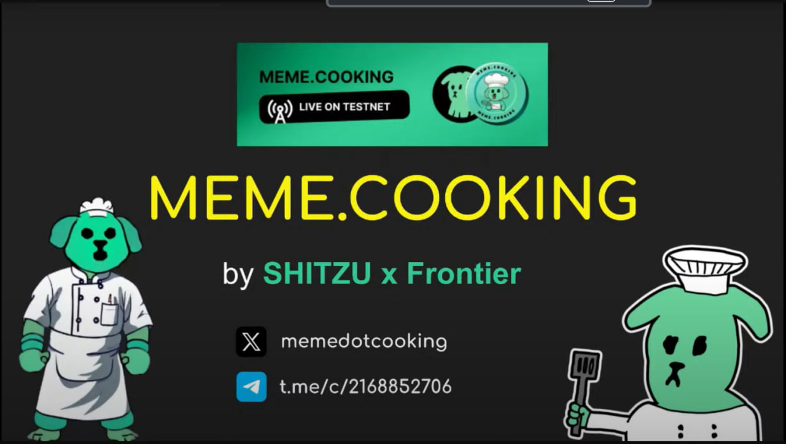
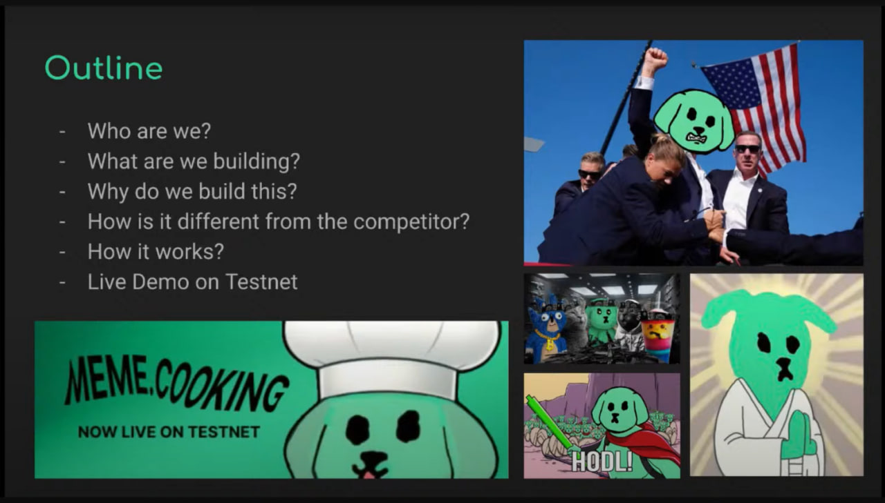

### Meme.cooking at NEAR Town Hall: A Detailed Recap

Recently, **meme.cooking** had the chance to present at the NEAR Town Hall, and it was an exciting opportunity to introduce our project to the wider NEAR community. For those who couldn’t make it, or if you just want a more detailed breakdown of our presentation, here’s everything you need to know about what we shared.

#### Introduction to meme.cooking: Who Are We?
We started off by giving a bit of background about **meme.cooking** and the people behind it. At its core, **meme.cooking** is a unique marketplace built on the **NEAR Protocol** that focuses on the creation, trading, and launching of meme coins.

So, what are meme coins, and why do they matter? If you’re familiar with the crypto space, you’ve probably seen coins like Dogecoin or Wifhat – these are meme coins. They’re fun, often community-driven, and can sometimes gain massive popularity due to their viral nature. However, the process of launching and trading meme coins can sometimes feel complicated, risky, or unfair, especially on traditional platforms. That’s where **meme.cooking** comes in.

We’re a group of creators and developers at SHITZU who are passionate about both memes and our community . We wanted to build a space that’s not only fun and accessible but also designed with fairness and transparency in mind. Essentially, we’re here to make the meme coin experience as enjoyable and user-friendly as possible on NEAR Protocol, while removing a lot of the risks that have historically plagued the crypto space.

#### What We’re Building and Why We’re Building It
At **meme.cooking**, we’re building a platform that allows anyone to easily create, buy, and trade meme coins. But we didn’t stop there – we wanted to make sure that the platform we’re building is fair, safe, and truly community-focused.

Let’s break down what makes **meme.cooking** different from the other memelaunchpad:
[diff](./thumbnail10.png)

1. **Fair and Transparent Process:** Many people who are new to cryptocurrency can feel left out or confused by how things work. On some platforms, you’re never really sure what’s happening behind the scenes – who’s getting the tokens, how prices are set, or what happens to your money. At **meme.cooking**, we’ve designed everything to be transparent, so you always know what’s going on.
  
2. **Unruggable:** If you’ve been around the crypto space, you’ve probably heard the term “rug pull.” This is when the creators of a project run off with the funds, leaving investors with nothing. It’s one of the biggest fears for anyone getting involved in new crypto projects. We’ve taken that risk out of the equation at **meme.cooking**. Our platform has built-in mechanisms that ensure that funds are locked and secure, making it literally unruggable. This way, users can participate confidently, knowing their money is safe.

3. **Refund Mechanism:** Not every project hits its funding goal, and we’ve made sure that when that happens, users don’t lose anything. If a meme coin doesn’t reach its funding target by the end of the auction, all staked funds are automatically refunded. No questions asked, no hassle – just a simple and secure way to participate without fear of losing your money.

4. **Focused on Fun, but Built for Success:** At the end of the day, meme coins are all about having fun. However, we’ve put a lot of work into ensuring that **meme.cooking** isn’t just another casual project. We’re serious about providing a robust marketplace where meme coins can thrive. Our goal is to create a space where people feel comfortable exploring, trading, and launching meme coins with the same level of confidence they would on a larger crypto exchange.

#### How Does meme.cooking Stand Out from Competitors?
There are other platforms out there where people can launch and trade tokens, but **meme.cooking** does things a bit differently.

First, we’ve structured the entire platform to focus on fairness. Every aspect of the process – from the auction system to the liquidity locking – is designed to make sure that no single person or group can control the outcome. We’re big believers in the idea that crypto should be accessible to everyone, and we’ve gone to great lengths to ensure that our platform reflects that.

Second, we’ve taken the idea of transparency to a whole new level. Everything on **meme.cooking** happens out in the open. For example, when a new coin is launched, the entire process is transparent. Users know exactly where their funds are going, how tokens are distributed, and how the platform fees are handled. There are no hidden mechanics or surprise fees – what you see is exactly what you get.

Lastly, we’re offering a unique combination of features that you won’t find anywhere else. From the staking-based price model to the auction-based token launch mechanism, **meme.cooking** is packed with innovative tools that make launching and trading meme coins not only fun but also profitable for users.

#### How Does meme.cooking Work? A Step-by-Step Breakdown
The core idea of **meme.cooking** is simple: we allow users to create and trade meme coins through a straightforward and secure process. Here’s how it works:

1. **Pick a Meme Coin:** First, you’ll browse the platform and choose a meme coin that interests you. Maybe it’s a coin related to your favorite meme, or perhaps it’s one you think has a ton of potential to go viral.

2. **Join the Auction:** Once you’ve picked your coin, you’ll participate in an auction to buy it. Auctions are limited-time events where users can stake their **NEAR** tokens to purchase the coin. It’s kind of like a fundraising period – if enough people are interested and the auction hits its goal, the coin gets created and distributed to the buyers.
[auction](./thumbnail5.png.jpg)
3. **Reach the Goal:** For a coin to officially be created, the auction needs to raise at least 4,000 NEAR tokens. This ensures that there’s enough interest and backing for the coin to be viable. If the goal is reached, the coin gets launched, and everyone who participated in the auction receives their share of the tokens.
   [notreached](./thumbnail4.png)

5. **Fair Distribution:** Once the coin is live, the tokens are distributed in a fair and transparent way. There’s no insider advantage or manipulation – everyone who staked their NEAR in the auction gets their fair share of the tokens based on how much they contributed.

6. **Liquidity Provision:** This is where things get even more interesting. Half of the newly created token supply, along with all the staked NEAR, is automatically deposited into **Ref Finance** (a popular decentralized exchange on the NEAR Protocol) to create liquidity. This helps ensure that there’s always a healthy market for trading the coin. Additionally, 50% of the tokens are burned, making the remaining supply even more valuable.

7. **Refund if Unsuccessful:** If the auction doesn’t reach its 4,000 NEAR goal, don’t worry – you won’t lose anything. All participants will receive a full refund of their staked NEAR. This built-in refund mechanism is one of the ways we’re making **meme.cooking** as safe and user-friendly as possible.

[refund](./thumbnail6.png.jpg)

#### Closing the Presentation: What’s Next for meme.cooking?
We wrapped up our presentation by emphasizing what’s next for **meme.cooking**. We’re currently in the **testnet** phase, which means we’re testing everything to make sure it works smoothly before we launch the mainnet. We also highlighted the upcoming beta testing program, where users can join and provide feedback in exchange for **$SHITZU** (our testnet reward token).

As we gear up for the mainnet launch, we want the community to know that **meme.cooking** is here to stay. Our mission is to create a safe, fair, and fun space for meme coin enthusiasts. Whether you’re here to trade, launch a coin, or just enjoy the memes, we’ve got something for you.

So, stay tuned – the kitchen’s heating up, and we can’t wait to show you what we’ve been cooking!
