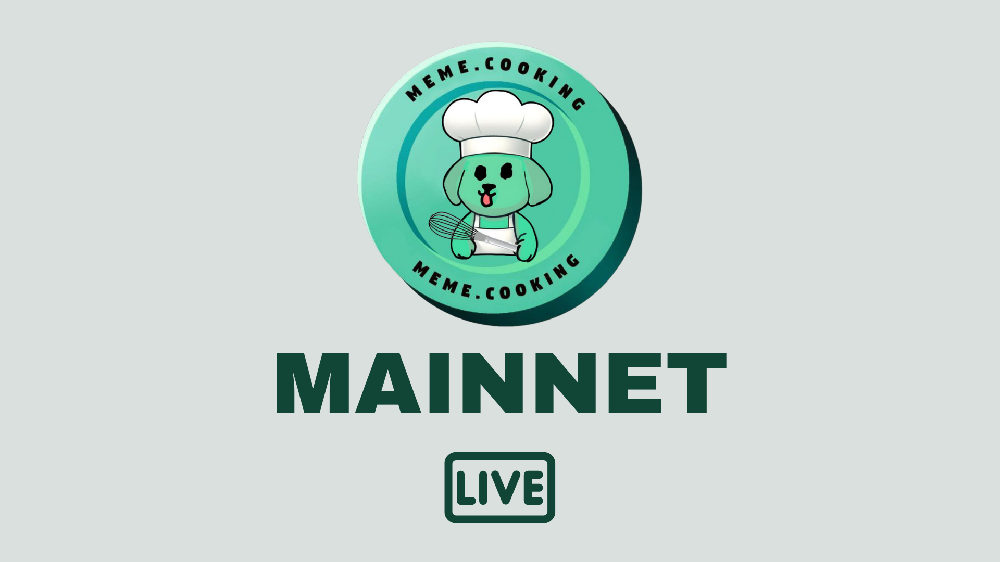

### Meme.Cooking Launches Today: A New Era for Meme tokens on NEAR**

The wait is over! [**Meme.Cooking**](https://meme.cooking) has officially launched, and we’re thrilled to introduce this game-changing platform to the NEAR Protocol community. After months of hard work, rigorous testing, and valuable feedback from our beta testers, Meme.Cooking is live and ready to disrupt the meme token space. Whether you're a meme token enthusiast, an investor, or someone new to the world of crypto, Meme.Cooking offers a fair, fun, and secure way to trade and launch meme tokens.

#### What is Meme.Cooking?

Meme.Cooking is a meme token launchpad built on NEAR Protocol and backed by Shitzu, designed to make meme token launches and trading safe, fair, and transparent. With a focus on community participation and security, we’ve created a platform where users can stake NEAR to support new projects and participate in auctions that give meme tokens a fair start.

Our approach is simple: if a coin reaches its auction goal, it’s launched and distributed fairly among the backers. If the goal isn’t met, participants receive a full refund, ensuring zero risk. This model, combined with locked liquidity for eight years, ensures that Meme.Cooking launches are unriggable and safe for all users.

#### What Sets Meme.Cooking Apart?

At Meme.Cooking, we’re not just another launchpad – we’re pioneering a new standard for fairness and security in the meme token world. Here are the key features that make us different:

- **Staking-Based Auctions**: Tokens are distributed based on the NEAR users stake during the auction, creating a fair price model.
- **Locked Liquidity**: 50% of the token supply and 100% of staked NEAR are locked on Ref Finance for eight years, ensuring long-term stability and protecting against rug pulls.
- **Refund Mechanism**: If the auction goal isn’t reached, every participant gets their staked NEAR back – no questions asked.
- **Fair Distribution**: meme tokens are distributed fairly among auction participants, giving everyone an equal opportunity to participate.

#### The Launch Process: What Happens Next?

Now that Meme.Cooking is live, you can dive right into the action. Here’s how it works:

1. **Choose a Coin**: Explore the coins that are launching on the platform.
2. **Join an Auction**: Stake your NEAR to participate in an auction for the meme token of your choice.
3. **Watch the Progress**: If the auction meets its NEAR goal, the coin is successfully launched.
4. **Fair Token Distribution**: Once the auction ends, tokens are distributed to participants based on the amount of NEAR they staked.
5. **Liquidity Locking**: After a successful launch, 50% of the token supply and all the NEAR staked are locked on Ref Finance for long-term liquidity.

#### A Big Thanks to Our Beta Chefs

To our beta testers, we couldn’t have done it without you! Your feedback and participation helped shape Meme.Cooking into the platform it is today.

#### The Future of Meme.Cooking

With Meme.Cooking now live, we’re just getting started. Stay tuned for more updates as we continue to roll out exciting new features and enhancements. Our vision is to become the go-to platform for meme token launches, bringing fairness and fun to the world of crypto.

#### Join the meme token Revolution Today!

The meme token revolution is happening right now on Meme.Cooking. Whether you’re looking to launch a new meme token, support a project, or just be part of something exciting, we invite you to join us. Head over to Meme.Cooking and start cooking up some coins today!

#### Conclusion

The launch of Meme.Cooking marks the beginning of a new chapter in the meme token space. We’re excited to see where this journey takes us and our community. Thank you for being part of the Meme.Cooking family – the best is yet to come!
