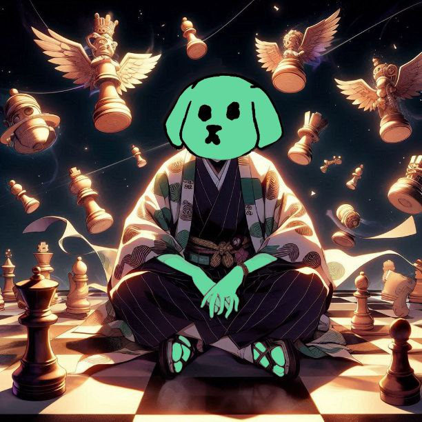

## Shitzu cheatsheet

As you may know, Shitzu aims to transition from a speculative meme coin to a sustainable ecosystem and community. To ensure this, we've developed a multi-layered offering.
Due to the increasing diversity of Shitzu-related services, we made a quick reference to help you identify official affiliations.

### 1. Relevant addresses

Relevant contracts and affiliated Shitzu accounts:
| Contract | Description | Explorer |
|----------|-------------|-----------|
| token.0xshitzu.near | Official token CA | [https://nearblocks.io/token/token.0xshitzu.near](https://nearblocks.io/token/token.0xshitzu.near) |
| shit.0xshitzu.near | Dogshit emission CA | [https://nearblocks.io/token/shit.0xshitzu.near](https://nearblocks.io/token/shit.0xshitzu.near) |
| rewards.0xshitzu.near | Shitstars CA | [https://nearblocks.io/token/rewards.0xshitzu.near](https://nearblocks.io/token/rewards.0xshitzu.near) |
| shitzu.pool.near | meme emission validator | [https://nearblocks.io/address/shitzu.pool.near](https://nearblocks.io/address/shitzu.pool.near) |
| shitzuapes.pool.near | near only validator | [https://nearscope.net/validator/shitzuapes.pool.near/tab/dashboard](https://nearscope.net/validator/shitzuapes.pool.near/tab/dashboard) |
| shitzu.bodega-lab.near | Revival NFT collection | [https://nearblocks.io/nft-token/shitzu.bodega-lab.near](https://nearblocks.io/nft-token/shitzu.bodega-lab.near) |
| shitzu.sputnik-dao.near | Treasury | [https://pikespeak.ai/wallet-explorer/shitzu.sputnik-dao.near/global](https://pikespeak.ai/wallet-explorer/shitzu.sputnik-dao.near/global) |
| | Worker | [https://pikespeak.ai/wallet-explorer/shitzu.marior.near/global](https://pikespeak.ai/wallet-explorer/shitzu.marior.near/global) |
| | Proposals | [https://dev.near.org/astraplusplus.ndctools.near/widget/home?tab=proposals&daoId=shitzu.sputnik-dao.near&page=dao](https://dev.near.org/astraplusplus.ndctools.near/widget/home?tab=proposals&daoId=shitzu.sputnik-dao.near&page=dao) |

> 📝  **Note:** Our offerings provide exposure to a diverse range of memecoins. Nevertheless, we exclusively endorse and are affiliated with the official contract addresses outlined in this reference guide.

### 2. Relevant links

A list of relevant links and endorsed endpoints:
| Category | Description | URI |
|----------|-------------|-----|
| Socials | Website | [https://shitzuapes.xyz](https://shitzuapes.xyz) |
| | Github | [https://github.com/Shitzu-Apes](https://github.com/Shitzu-Apes) |
| | Blog | [https://shitzuapes.xyz/blog](https://shitzuapes.xyz/blog) |
| | Twitter | [https://x.com/shitzuonnear](https://x.com/shitzuonnear) |
| | | [https://x.com/ShitzuCommunity](https://x.com/ShitzuCommunity) |
| | | [https://x.com/memedotcooking](https://x.com/memedotcooking) |
| | Telegram | [https://t.me/Shitzu_Community](https://t.me/Shitzu_Community) |
| | | [https://t.me/memedotcooking](https://t.me/memedotcooking) |
| | | [https://t.me/ShitzuTasks](https://t.me/ShitzuTasks) |
| Apps | Landing page | [https://app.shitzuapes.xyz](https://app.shitzuapes.xyz) |
| | Meme.cooking | [https://meme.cooking](https://meme.cooking) |
| | Token farm | [https://tkn.shitzuapes.xyz](https://tkn.shitzuapes.xyz) |
| | Meme validator | [https://app.shitzuapes.xyz/stake](https://app.shitzuapes.xyz/stake) |
| | On-chain reputation | [https://app.shitzuapes.xyz/shitstars](https://app.shitzuapes.xyz/shitstars) |
| | Shitchat alpha | [https://app.shitzuapes.xyz/shitchat](https://app.shitzuapes.xyz/shitchat) |
| | Daily claim | [https://app.shitzuapes.xyz/account](https://app.shitzuapes.xyz/account) |
| | Deposit collector | [https://near.social/marior.near/widget/StorageFreeing](https://near.social/marior.near/widget/StorageFreeing) |
| API's | Meme.cooking | [https://api.meme.cooking](https://api.meme.cooking) |
| | RPC | [https://rpc.shitzuapes.xyz](https://rpc.shitzuapes.xyz) |
| Markets | Buy | [https://app.ref.finance/#near\|token.0xshitzu.near](https://app.ref.finance/#near\|token.0xshitzu.near) |
| | Farms | [https://app.ref.finance/v2farms/4369-r](https://app.ref.finance/v2farms/4369-r) |
| | Liquidity | [https://app.ref.finance/pool/4369](https://app.ref.finance/pool/4369) |
| | | [https://app.ref.finance/pool/5472](https://app.ref.finance/pool/5472) |
| | Meme season | [https://app.ref.finance/meme](https://app.ref.finance/meme) |
| | Pairs | [https://www.dextools.io/app/en/near/pair-explorer/4369?t=1730302104653](https://www.dextools.io/app/en/near/pair-explorer/4369?t=1730302104653) |
| | | [https://dexscreener.com/near/refv1-4369](https://dexscreener.com/near/refv1-4369) |
| | | [https://www.coingecko.com/en/coins/shitzu](https://www.coingecko.com/en/coins/shitzu) |
| | Bots | [https://www.deltatrade.ai/bots/grid/vaults/SHITZU_USDC](https://www.deltatrade.ai/bots/grid/vaults/SHITZU_USDC) |
| | | [https://www.deltatrade.ai/bots/dca/vaults/SHITZU_NEAR](https://www.deltatrade.ai/bots/dca/vaults/SHITZU_NEAR) |
| Revival NFT | Tradeport | [https://www.tradeport.xyz/near/collection/shitzu.bodega-lab.near](https://www.tradeport.xyz/near/collection/shitzu.bodega-lab.near) |
| | Mitte | [https://beta.mitte.gg/?contractAddress=shitzu.bodega-lab.near](https://beta.mitte.gg/?contractAddress=shitzu.bodega-lab.near) |
| | Mintbase | [https://www.mintbase.xyz/contract/shitzu.bodega-lab.near/nfts/all/0](https://www.mintbase.xyz/contract/shitzu.bodega-lab.near/nfts/all/0) |
| | Paras | [https://paras.id/collection/shitzu.bodega-lab.near](https://paras.id/collection/shitzu.bodega-lab.near) |
| Others | Dappradar | [https://dappradar.com/dapp/shitzu](https://dappradar.com/dapp/shitzu) |
| | Stats | [https://plausible.io/app.shitzuapes.xyz](https://plausible.io/app.shitzuapes.xyz) |
| | HOT shitzu village | [https://t.me/herewalletbot/app?startapp=village13999](https://t.me/herewalletbot/app?startapp=village13999) |

> ⚠️ **Warning:** To mitigate risks, it is imperative to validate the authenticity of applications and platforms via authorized sources. Our applications and services require solely a restricted FunctionCall access key. A FullAccess key is **never** required.

### 3. Shitstars - GM NFT game

| Description  | Preview                                                                                                                                             | URI                                                                                                                                                                                        |
| ------------ | --------------------------------------------------------------------------------------------------------------------------------------------------- | ------------------------------------------------------------------------------------------------------------------------------------------------------------------------------------------ |
| The Shitstar |         | [https://wallet.bitte.ai/claim/chronear-1%E2%81%B0-top-shitstars--by-evandrozec.near:08850](https://wallet.bitte.ai/claim/chronear-1%E2%81%B0-top-shitstars--by-evandrozec.near:08850)     |
| #2           |         | [https://wallet.bitte.ai/claim/david\_\_mo-2%E2%81%B0-top-shitstars--by-evandrozec.near:60010](https://wallet.bitte.ai/claim/david__mo-2%E2%81%B0-top-shitstars--by-evandrozec.near:60010) |
| #3           |         | [https://wallet.bitte.ai/claim/lucassmithvn-3%E2%81%B0-shitstars--by-evandrozec.near:27207](https://wallet.bitte.ai/claim/lucassmithvn-3%E2%81%B0-shitstars--by-evandrozec.near:27207)     |
| #4           |         | [https://wallet.bitte.ai/claim/travbori-4⁰-shitstars--by-evandrozec.near:44101](https://wallet.bitte.ai/claim/travbori-4⁰-shitstars--by-evandrozec.near:44101)                             |
| #5           |         | [https://wallet.bitte.ai/claim/odin-top-10-shitstars--by-evandrozec.near:25000](https://wallet.bitte.ai/claim/odin-top-10-shitstars--by-evandrozec.near:25000)                             |
| #6           |         | [https://wallet.bitte.ai/claim/jarednotjerry-5⁰-shitstars--by-evandrozec.near:02180](https://wallet.bitte.ai/claim/jarednotjerry-5⁰-shitstars--by-evandrozec.near:02180)                   |
| #7           |         | [https://wallet.bitte.ai/claim/tattothetoo-top-6⁰-shitstars--by-evandrozec.near:88915](https://wallet.bitte.ai/claim/tattothetoo-top-6⁰-shitstars--by-evandrozec.near:88915)               |
| #8           |         | [https://wallet.bitte.ai/claim/bennybrown-by-evandrozec.near:90518](https://wallet.bitte.ai/claim/bennybrown-by-evandrozec.near:90518)                                                     |
| #9           |         | [https://wallet.bitte.ai/claim/kvshnir-10%E2%81%B0-top-shitstars--by-evandrozec.near:12722](https://wallet.bitte.ai/claim/kvshnir-10%E2%81%B0-top-shitstars--by-evandrozec.near:12722)     |
|              |         | [https://wallet.bitte.ai/claim/-kvshnir-9⁰-top-shitstars--by-evandrozec.near:48960](https://wallet.bitte.ai/claim/-kvshnir-9⁰-top-shitstars--by-evandrozec.near:48960)                     |
| #10          |        | [https://wallet.bitte.ai/claim/timothyavery-7%E2%81%B0-shitstars--by-evandrozec.near:04053](https://wallet.bitte.ai/claim/timothyavery-7%E2%81%B0-shitstars--by-evandrozec.near:04053)     |
| #brain       |     | [https://wallet.bitte.ai/claim/mario-this-great-brain-shitstars!--by-evandrozec.near:58797](https://wallet.bitte.ai/claim/mario-this-great-brain-shitstars!--by-evandrozec.near:58797)     |
| #master      |    | [https://wallet.mintbase.xyz/claim/ojeik003-by-evandrozec.near:60757](https://wallet.mintbase.xyz/claim/ojeik003-by-evandrozec.near:60757)                                                 |
| #wildcard    |  | [https://wallet.bitte.ai/claim/naomiii-by-evandrozec.near:74069](https://wallet.bitte.ai/claim/naomiii-by-evandrozec.near:74069)                                                           |
| #11          |        | [https://wallet.bitte.ai/claim/devbose-8⁰-shitstars--by-evandrozec.near:70130](https://wallet.bitte.ai/claim/devbose-8⁰-shitstars--by-evandrozec.near:70130)                               |
| #12          |        | [https://wallet.bitte.ai/claim/marshmello-new-9⁰-shitstars--by-evandrozec.near:94235](https://wallet.bitte.ai/claim/marshmello-new-9⁰-shitstars--by-evandrozec.near:94235)                 |
| #13          |        | [https://wallet.bitte.ai/claim/motinha.near-10⁰--by-evandrozec.near:34048](https://wallet.bitte.ai/claim/motinha.near-10⁰--by-evandrozec.near:34048)                                       |
|              |        | [https://wallet.bitte.ai/claim/motinha-9⁰-shitstars--by-evandrozec.near:90883](https://wallet.bitte.ai/claim/motinha-9⁰-shitstars--by-evandrozec.near:90883)                               |
| #69          |        | [https://wallet.bitte.ai/claim/shitstars-69⁰-by-evandrozec.near:79376](https://wallet.bitte.ai/claim/shitstars-69⁰-by-evandrozec.near:79376)                                               |

> 💡  **Tip:** Remember to say 'GM' once in a while on TG and get rewarded in $SHITZU + $SHITSTARS💩

### 4. Sharddogs

| Description    | Preview                                                                    | URI                                                                  |
| -------------- | -------------------------------------------------------------------------- | -------------------------------------------------------------------- |
| dogshit        |              | [https://shard.dog/shitzu](https://shard.dog/shitzu)                 |
| memedotcooking |    | [https://shard.dog/memedotcooking](https://shard.dog/memedotcooking) |
| halloween      |  | [https://shard.dog/trickortreat](https://shard.dog/trickortreat)     |

So, there you have it! Shitzu is not your average meme coin, it's rapidly evolving into a force to be reckoned with!
